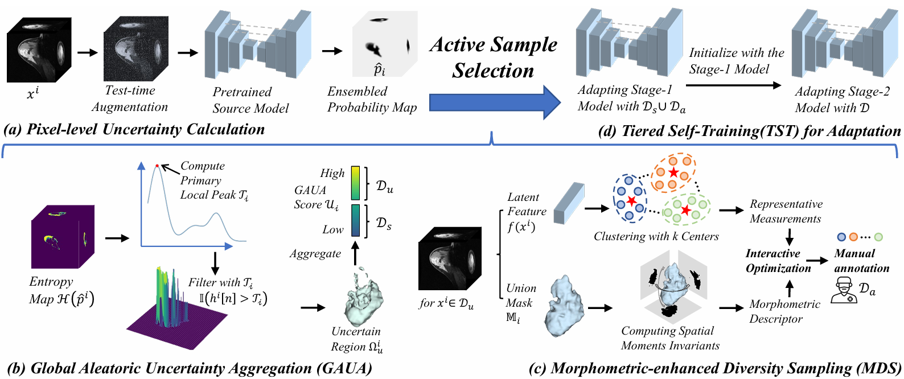

# UMDM-SFADA

Official PyTorch implementation of **Uncertainty-guided Morphometric-enhanced Diversity Modeling in Source-free Active Domain Adaptive Cross-center Tumor Segmentation**.

UMDM-SFADA is designed for cross-center medical image segmentation when source-domain data are unavailable during target-domain adaptation. The repository contains source-model training, uncertainty-guided active sample selection, semi-supervised fine-tuning, and evaluation scripts for both 2D and 3D tumor segmentation.

<div align="center">
  
</div>

## Repository Structure

```text
UMDM-SFADA/
|-- code/
|   |-- 2D_train.py           # Source 2D model training
|   |-- 2D_selection.py       # Active slice selection
|   |-- 2D_finetuning.py      # 2D target-domain fine-tuning
|   |-- 2D_test_fully.py      # 2D inference and evaluation
|   |-- 3D_train.py           # Source 3D model training
|   |-- 3D_selection.py       # Active volume selection
|   |-- 3D_finetuning.py      # 3D target-domain fine-tuning
|   |-- 3D_test_fully.py      # 3D inference and evaluation
|   |-- dataloaders/          # Dataset and sampler definitions
|   |-- networks/             # 2D network definitions
|   |-- dynamic_network/      # Dynamic 3D U-Net related code
|   |-- data_augmentation/    # Data augmentation transforms
|   |-- utils/                # Losses, metrics, and helper functions
|   `-- framework.png
`-- readme.md
```

Training scripts save checkpoints and copied source code under `model/` relative to the repository root when they are launched from `code/`.

## Environment

The project was developed with PyTorch and CUDA. A typical setup is:

```bash
conda create -n umdm-sfada python=3.10 -y
conda activate umdm-sfada

# Install a PyTorch build that matches your CUDA driver.
pip install torch torchvision --index-url https://download.pytorch.org/whl/cu121

pip install numpy scipy scikit-learn scikit-image pandas h5py opencv-python \
  matplotlib tqdm tensorboardX medpy nibabel SimpleITK nnunetv2 \
  dynamic-network-architectures fft-conv-pytorch
```

Notes:

- `nnunetv2` is required by the local Dice/compound loss implementation.
- `dynamic-network-architectures` is required by the 3D U-Net implementation.

## Dataset Preparation

Organize each dataset as follows:

```text
data/
`-- YOUR_DATASET/
    |-- trainlist.txt                 # 3D training volumes, e.g. case001.h5
    |-- train_slices.txt              # 2D training slices, e.g. case001_slice_0.h5
    |-- vallist.txt                   # Validation volumes
    |-- testlist.txt                  # Testing volumes
    |-- stage1_<active_method>.txt    # Stage-1 selected 3D samples
    |-- all_<active_method>.txt       # Stage-2 3D samples
    |-- all_slice_<active_method>.txt # Stage-2 2D slices
    |-- case001.h5
    |-- case002.h5
    `-- slices/
        |-- case001_slice_0.h5
        |-- case001_slice_1.h5
        `-- ...
```

Each HDF5 file is expected to contain:

- `image`: input image array.
- `label`: segmentation mask.
- `spacing`: voxel spacing, required by the full testing scripts for metric computation.

For 3D training/testing, list files such as `case001.h5` in `trainlist.txt`, `vallist.txt`, and `testlist.txt`. For 2D training, list slice files such as `case001_slice_0.h5` in `train_slices.txt`; the loader reads them from `slices/`.

### Preprocessed Data Download

Preprocessed datasets, including `.h5` files and index `.txt` files, are provided through Baidu Netdisk:

- Link: [https://pan.baidu.com/s/12-syXo7j-8mjQTEdQyYDcQ](https://pan.baidu.com/s/12-syXo7j-8mjQTEdQyYDcQ)
- Extraction code: `d97y`

After downloading, extract the files and pass the extracted dataset directory to `--root_path`.

## Usage

Run all commands from the `code/` directory:

```bash
cd code
```

### 1. Train a Source Model

3D source training:

```bash
python 3D_train.py \
  --root_path /path/to/data/YOUR_DATASET \
  --exp source_3d \
  --max_iterations 60000 \
  --batch_size 4
```

2D source training:

```bash
python 2D_train.py \
  --root_path /path/to/data/YOUR_DATASET \
  --exp source_2d \
  --max_iterations 60000 \
  --batch_size 24
```

Source training with the default `--labeled_num None` saves the best checkpoint to:

```text
../model/<exp>_source/UNet_best_model.pth
```

For example, `--exp source_3d` saves:

```text
../model/source_3d_source/UNet_best_model.pth
```

### 2. Select Active Target Samples

3D target-volume selection:

```bash
python 3D_selection.py \
  --root_path /path/to/data/YOUR_TARGET_DATASET \
  --exp source_3d_source \
  --C 4 \
  --tta_num 8
```

2D target-slice selection:

```bash
python 2D_selection.py \
  --root_path /path/to/data/YOUR_TARGET_DATASET \
  --exp source_2d_source \
  --C 4 \
  --tta_num 8
```

The selection scripts load:

```text
../model/<exp>/UNet_best_model.pth
```

They write active-learning index files back into `--root_path`, such as:

```text
stage1_<method>.txt
all_<method>.txt
selection_<method>.txt
all_slice_<method>.txt
```

Use the generated `<method>` string as `--active_method` in the fine-tuning step.

### 3. Fine-tune on the Target Domain

3D fine-tuning:

```bash
python 3D_finetuning.py \
  --root_path /path/to/data/YOUR_TARGET_DATASET \
  --exp target_3d_umdm \
  --pretrained_path ../model/source_3d_source/UNet_best_model.pth \
  --active_method UMEM \
  --labeled_num 10 \
  --max_iterations 20000 \
  --batch_size 4 \
  --labeled_bs num_of_your_labeled_sample
```

2D fine-tuning:

```bash
python 2D_finetuning.py \
  --root_path /path/to/data/YOUR_TARGET_DATASET \
  --exp target_2d_umdm \
  --pretrained_path ../model/source_2d_source/UNet_best_model.pth \
  --active_method UMEM \
  --labeled_num 100 \
  --max_iterations 20000 \
  --batch_size 24 \
  --labeled_bs num_of_your_labeled_sample
```

Fine-tuning saves the best checkpoint to:

```text
../model/<exp>_<labeled_num>/UNet_best_model.pth
```

### 4. Test and Evaluate

3D evaluation:

```bash
python 3D_test_fully.py \
  --root_path /path/to/data/YOUR_TARGET_DATASET \
  --exp target_3d_umdm \
  --model UNet
```

2D evaluation:

```bash
python 2D_test_fully.py \
  --root_path /path/to/data/YOUR_TARGET_DATASET \
  --exp target_2d_umdm \
  --model UNet \
  --target_set test
```

Evaluation writes NIfTI predictions and metric files under:

```text
../model/<exp>/<model>_<dataset>_predictions/
../model/<exp>/<model>_<dataset>_<target_set>_predictions/
```

## Important Parameters

| Parameter | Used in | Description |
| --- | --- | --- |
| `--root_path` | All main scripts | Path to the dataset directory. |
| `--exp` | All main scripts | Experiment name. Also controls checkpoint path under `../model/`. |
| `--pretrained_path` | Train/fine-tune scripts | Optional checkpoint to initialize the model. Required for adaptation fine-tuning. |
| `--active_method` | Fine-tuning scripts | Method suffix matching generated files such as `all_<method>.txt` or `all_slice_<method>.txt`. |
| `--labeled_num` | Fine-tuning scripts | Number of labeled active samples placed at the beginning of the generated `all*` list. |
| `--C` | Selection scripts | Candidate capacity multiplier for uncertainty-guided selection. |
| `--tta_num` | Selection scripts | Number of test-time augmentations used to estimate uncertainty. |
| `--patch_size` | Train/fine-tune scripts | Input crop size. Defaults are `[128, 128, 128]` for 3D and `[320, 320]` for 2D. |

## Implementation Notes

Before launching long experiments, check these current code details:

- `2D_train.py` and `3D_selection.py` import `dataloaders.dataset_3d`, while this repository provides `dataloaders/dataset.py`. If you see `ModuleNotFoundError: dataloaders.dataset_3d`, change those imports to `from dataloaders.dataset import ...`.
- `2D_finetuning.py` and `3D_finetuning.py` use `inquire=True` in `argparse.add_argument`; standard `argparse` does not support this keyword. Replace it with `required=True` or remove it before running.
- `2D_selection.py` and `3D_selection.py` reference `parser.size_regulization`, but the declared flag is `--mophology_enhancement`. Add a matching argument or change the condition to the declared flag.
- Several boolean arguments use `type=bool`; in standard argparse, strings such as `"False"` may still evaluate to `True`. For robust runs, prefer editing defaults or converting these arguments to `store_true`/`store_false` flags.
- The scripts assume CUDA is available and call `.cuda()` directly.

## Dataset Citation

If you use the preprocessed datasets provided in this repository, please cite the corresponding original papers in addition to this work.

### NPC-GTV Segmentation

```bibtex
@article{li2025dataset,
  title={A dataset of primary nasopharyngeal carcinoma MRI with multi-modalities segmentation},
  author={Li, Yin and Chen, Qi and Li, Meige and Si, Liping and Guo, Yingwei and Xiong, Yu and Wang, Qixing and Qin, Yang and Xu, Ling and Smagt, Patrick van der and others},
  journal={Scientific Data},
  volume={12},
  number={1},
  pages={1450},
  year={2025},
  publisher={Nature Publishing Group UK London}
}

@article{wang2024dual,
  title={Dual-reference source-free active domain adaptation for nasopharyngeal carcinoma tumor segmentation across multiple hospitals},
  author={Wang, Hongqiu and Chen, Jian and Zhang, Shichen and He, Yuan and Xu, Jinfeng and Wu, Mengwan and He, Jinlan and Liao, Wenjun and Luo, Xiangde},
  journal={IEEE Transactions on Medical Imaging},
  year={2024},
  volume={43},
  number={12},
  pages={4078-4090},
  publisher={IEEE}
}

@article{luo2023deep,
  title={Deep learning-based accurate delineation of primary gross tumor volume of nasopharyngeal carcinoma on heterogeneous magnetic resonance imaging: A large-scale and multi-center study},
  author={Luo, Xiangde and Liao, Wenjun and He, Yuan and Tang, Fan and Wu, Mengwan and Shen, Yuanyuan and Huang, Hui and Song, Tao and Li, Kang and Zhang, Shichuan and others},
  journal={Radiotherapy and Oncology},
  volume={180},
  pages={109480},
  year={2023},
  publisher={Elsevier}
}

@article{luo2025generalizable,
  title={Generalizable Magnetic Resonance Imaging-based Nasopharyngeal Carcinoma Delineation: Bridging Gaps Across Multiple Centers and Raters With Active Learning},
  author={Luo, Xiangde and Wang, Hongqiu and Xu, Jinfeng and Li, Lu and Zhao, Yue and He, Yuan and Huang, Hui and Xiao, Jianghong and Song, Tao and Zhang, Shichuan and others},
  journal={International Journal of Radiation Oncology* Biology* Physics},
  volume={121},
  number={5},
  pages={1384--1393},
  year={2025},
  publisher={Elsevier}
}
```

### BC Segmentation

```bibtex
@article{garrucho2025large,
  title={A large-scale multicenter breast cancer DCE-MRI benchmark dataset with expert segmentations},
  author={Garrucho, Lidia and Kushibar, Kaisar and Reidel, Claire-Anne and Joshi, Smriti and Osuala, Richard and Tsirikoglou, Apostolia and Bobowicz, Maciej and Del Riego, Javier and Catanese, Alessandro and Gwo{\'z}dziewicz, Katarzyna and others},
  journal={Scientific data},
  volume={12},
  number={1},
  pages={453},
  year={2025},
  publisher={Nature Publishing Group UK London}
}
```

## Acknowledgements

This implementation builds on common medical image segmentation utilities, nnU-Net style losses, and dynamic U-Net architecture components. Thanks to the authors of the referenced datasets and open-source toolkits.
